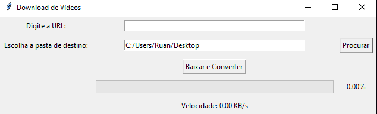

# yt_dlp + ffmpeg GUI

Este projeto é uma aplicação GUI em Python que permite baixar vídeos do YouTube e convertê-los para o formato MP4, mantendo o nome original do vídeo. A aplicação também exibe uma barra de progresso e a velocidade do download.

## Funcionalidades

- **Download de vídeos**: Baixa vídeos do YouTube na melhor qualidade disponível (áudio e vídeo combinados).
- **Conversão de vídeos**: Converte o vídeo baixado para MP4 sem re-encode.
- **Barra de progresso**: Exibe o progresso do download em tempo real.
- **Velocidade de download**: Mostra a velocidade atual do download.
- **Escolha da pasta de destino**: Permite ao usuário escolher a pasta onde o vídeo será salvo.
- **Salvar configuração da pasta de destino**: Lembra a pasta de destino escolhida pelo usuário em execuções futuras.

## Dependências

- Python 3.x
- [yt-dlp](https://github.com/yt-dlp/yt-dlp)
- [FFmpeg](https://ffmpeg.org/)
- `tkinter` (geralmente incluído na instalação padrão do Python)
- `configparser`

## Instalação

1. **Clone o repositório**:
    ```sh
    git clone https://github.com/seu-usuario/video-downloader-converter.git
    cd video-downloader-converter
    ```

2. **Instale as dependências**:
    ```sh
    pip install yt-dlp
    ```

3. **Certifique-se de que o FFmpeg está instalado e disponível no PATH**. Você pode baixar o FFmpeg [aqui](https://ffmpeg.org/download.html) e seguir as instruções de instalação para o seu sistema operacional.

## Uso

1. Execute o script:
    ```sh
    python video_downloader_converter.py
    ```

2. Digite a URL do vídeo que deseja baixar.

3. Escolha a pasta de destino onde o vídeo será salvo.

4. Clique no botão "Baixar e Converter".

5. Aguarde enquanto o vídeo é baixado e convertido. O progresso e a velocidade do download serão exibidos na interface.

## Exemplo de Interface

  *(Inclua uma captura de tela da sua interface aqui)*

## Contribuição

Contribuições são bem-vindas! Sinta-se à vontade para abrir issues ou enviar pull requests com melhorias ou correções.

## Licença

Este projeto está licenciado sob a Licença MIT. Veja o arquivo [LICENSE](LICENSE) para mais detalhes.
